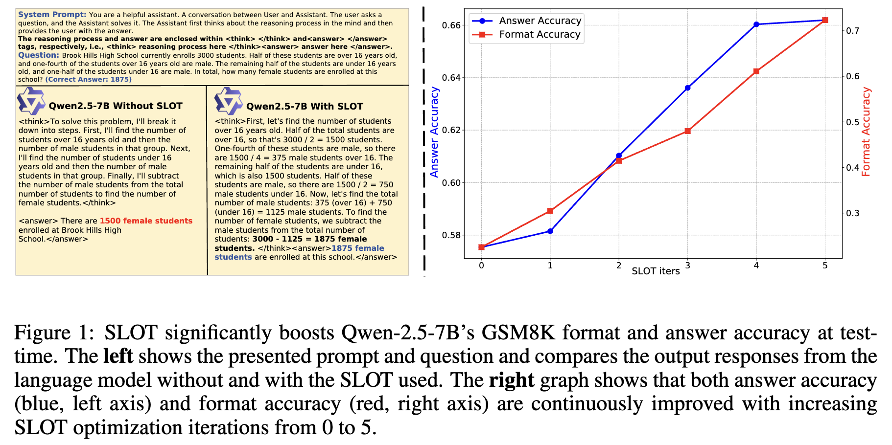
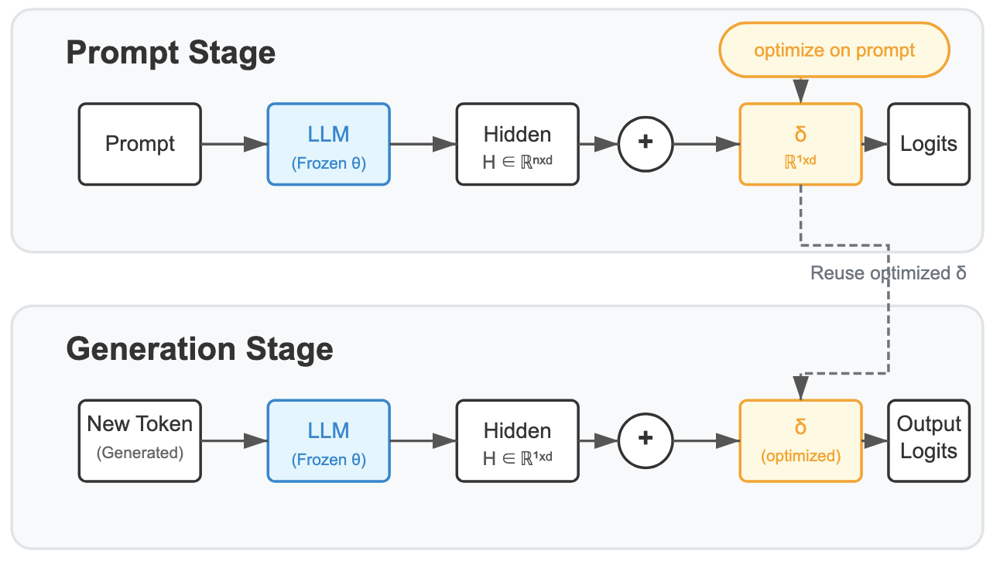

# SLOT: Sample-specific Language Model Optimization at Test-time

***fully open sourced!! the full reasoning results are in SLOT/vllm/logs/***

***Training free, simple but effective test-time adaptation***

***Fast, low overhead, easy to adapt to your research***

SLOT is a test-time inference technique that optimizes a lightweight, sample-specific parameter vector for a few steps on the input prompt. This helps the model better align with and follow the given instruction.



## How it works?
The goal of the proposed SLOT approach is to adapt the trained LM to individual prompts at test-time. When a prompt is given, SLOT generates a response with two phases.
- First, in the *Prompt Stage* we seek to learn a sample-specific **light-weight** vector $\delta\in\mathcal{R}^{1\times d}$ that can be directly added on the final hidden features $H$ from the LLM without incuring heavy computing overhead.
- Second, in the *Generation Stage*, we apply $\delta$ to the final hidden features $H$ for the next-token prediction to generate a complete response with the test-time adapted $\delta$.



## Getting Started

### Prerequisites

- Python 3.10.15
- torch==2.5.1
- transformers==4.49.0.dev0
- datasets==3.2.0
- vllm==0.7.2  ## only needed for AIME/MATH500/GPQA DIAMOND
- lighteval==0.8.1  ## only needed for AIME/MATH500/GPQA DIAMOND


## Run SLOT on GSM-8K

We provide the inference code [eval_only_slot.py](eval_only_slot.py) to evaluate models on [GSM8k](https://huggingface.co/datasets/openai/gsm8k). If you would like to inference with other prompts, feel free to modify the code!

Please refer [run.sh](run.sh) for example commands.

Hyper-parameters in SLOT are set with environment variables. If `times=0` is set, then the model is inferenced without SLOT optimzation.

Output logs are saved in `logs/log_times_<times_value>_lr_<lr_value>.txt`.

## SLOT for LLM on reasonining Benchmarks from open-r1 (AIME/MATH500/GPQA DIAMOND)

1. **Directly** replace `model_runner.py` in `vllm` with model_runner.py with SLOT integrated.
To enable SLOT within the `vllm` inference framework, replace the original `model_runner.py` file (replace your vllm/worker/model_runner.py with ours):
```bash
cp ./vllm/model_runner.py "$(python -c 'import vllm, os; print(os.path.join(os.path.dirname(vllm.__file__), "worker"))')"
```
2. Run Inference with SLOT
Execute the following script to launch inference with SLOT support:
```shell
bash run_vllm.sh  ## change the setting here, you can refer to the SLOT/vllm/logs/ to reproduce the results.
```

## SLOT results


## SLOT - 20-Second Quick Integration Guide

### 🚀 Evaluation Script Modification (Reset signal for each new prompt), e.g. in eval_only_slot.py

```python
# Add this line before model.generate(). This sets a flag to inform the model that the upcoming forward pass is for the 'Prompt Stage' optimization.
os.environ["prompt_only"] = "True"  
outputs = model.generate(**inputs, **generation_params)
```

### 🚀 Model Forward Modification (Insert between hidden_states and lm_head), e.g. in modeling_qwen2_slot.py

```python
def forward(self, input_ids, ...):
    # ... existing code ...
    hidden_states = outputs[0]  # Get hidden states from backbone
    
    ###### SLOT begin ###### don't forget to import os
    prompt_only = os.environ.get("prompt_only", "False") == "True" 
    if prompt_only:
        times = int(os.environ.get("times", 5))        # Optimization steps
        lr = float(os.environ.get("lr", 0.1))          # Learning rate
        
        with torch.enable_grad():
            # Create learnable delta vector
            delta = nn.Parameter(0.0 * torch.randn([1,1, hidden_states.shape[-1]]).to(hidden_states))
            optimizer = torch.optim.AdamW([delta], lr=lr, weight_decay=1e-8, eps=1e-5)
            
            # Few gradient descent steps to optimize delta
            for _ in range(times):
                optimizer.zero_grad()
                logits = self.lm_head(hidden_states + delta)
                
                # Calculate loss using current input
                loss_fct = nn.CrossEntropyLoss()
                shift_logits = logits[..., :-1, :].contiguous()
                shift_labels = input_ids[:, 1:].contiguous()
                loss = loss_fct(shift_logits.view(-1, shift_logits.size(-1)), shift_labels.view(-1))
                
                loss.backward()
                optimizer.step()
            
            self.delta = delta  # Save optimized delta
            hidden_states = hidden_states + self.delta
            os.environ["prompt_only"] = "False"
    else:
        hidden_states = hidden_states + self.delta  # Reuse previous delta
    ###### SLOT end ######
    
    logits = self.lm_head(hidden_states)  # Original lm_head call
    # ... existing code ...
```


## Contact
If you have any problem, welcome issues, or contact Yang Hu (Email: huyangtorus@gmail.com, Wechat: 18840249731)


```bibtex
@misc{hu2025slotsamplespecificlanguagemodel,
      title={SLOT: Sample-specific Language Model Optimization at Test-time},
      author={Yang Hu and Xingyu Zhang and Xueji Fang and Zhiyang Chen and Xiao Wang and Huatian Zhang and Guojun Qi},
      year={2025},
      eprint={2505.12392},
      archivePrefix={arXiv},
      primaryClass={cs.CL},
      url={[https://arxiv.org/abs/2505.12392](https://arxiv.org/abs/2505.12392)},
}

